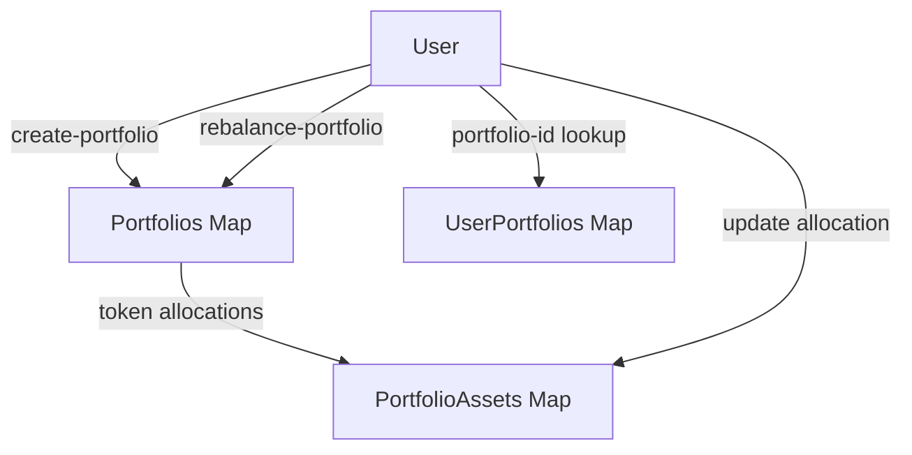

# 📊 SatsFlow - Intelligent Asset Orchestration Protocol

## Overview

**SatsFlow** is a next-generation decentralized portfolio automation platform designed for institutional-grade digital asset management. Built on the **Stacks Layer 2**, it leverages **Bitcoin’s unmatched security** while delivering intelligent portfolio orchestration, dynamic optimization, and fee-efficient rebalancing mechanisms.

By abstracting away the complexity of multi-asset strategies, SatsFlow enables investors to construct, monitor, and optimize portfolios seamlessly. Its architecture prioritizes **algorithmic precision, robust validation, and automated wealth-building experiences** in the Bitcoin-secured DeFi ecosystem.

---

## ✨ Key Features

* **Multi-Asset Portfolio Creation** – Define sophisticated portfolios across up to 10 tokens.
* **Algorithmic Rebalancing** – Automated rebalancing to maintain allocations against market fluctuations.
* **Fee Optimization** – Execution with protocol-level fee efficiency.
* **User-Centric Management** – Query, update, and rebalance portfolios via secure Clarity functions.
* **Bitcoin-Secured Infrastructure** – All state and execution logic anchored to Bitcoin finality through Stacks.

---

## ⚙️ System Overview

The protocol is structured into **four major layers**:

1. **Portfolio Registry Layer**

   * Manages global portfolio metadata, ownership, and allocation status.
   * Handles creation, activation, and historical recordkeeping of portfolios.

2. **Asset Allocation Layer**

   * Tracks allocation ratios, token identities, and balances per portfolio.
   * Enforces validation rules for percentage distributions and maximum token limits.

3. **Execution Layer**

   * Executes portfolio rebalancing logic.
   * Updates portfolio state to reflect target allocations and new timestamps.

4. **Governance & Protocol Layer**

   * Controlled by `protocol-owner`.
   * Configures global parameters such as protocol fees and ownership transfers.

---

## 📐 Contract Architecture

The contract is divided into **functional modules**:

### Core Data Structures

* **Portfolios**: Registry of portfolios keyed by `portfolio-id`.
* **PortfolioAssets**: Mapping of portfolio-specific token allocations.
* **UserPortfolios**: Mapping of principals to their owned portfolio IDs.

### Constants & Configuration

* **Error Codes**: Comprehensive error registry for robust validation.
* **System Constants**: Constraints such as `MAX-TOKENS-PER-PORTFOLIO` and `BASIS-POINTS`.
* **Protocol Config**: Owner, fee basis points, and global portfolio counter.

### Public Functions

* `create-portfolio`: Instantiate a portfolio with custom allocations.
* `rebalance-portfolio`: Execute intelligent rebalancing logic.
* `update-portfolio-allocation`: Adjust allocation percentages dynamically.
* `get-portfolio`, `get-portfolio-asset`, `get-user-portfolios`: Query interfaces.

### Private Utility Functions

* Validation helpers for tokens, percentages, and portfolio state.
* Initialization logic for registering assets and ownership.

---

## 🔄 Data Flow (Simplified)



1. **User creates a portfolio** → new entry stored in `Portfolios` and mapped under `UserPortfolios`.
2. **Assets initialized** → stored in `PortfolioAssets` with percentage allocations.
3. **Rebalancing triggered** → updates `Portfolios` state with `last-rebalanced`.
4. **Adjustments** → `PortfolioAssets` updated per user allocation updates.

---

## 🛡️ Security Considerations

* **Authorization Enforcement**: Only portfolio owners can rebalance or adjust allocations.
* **Validation Framework**: Ensures allocation percentages sum within bounds.
* **Constraint Enforcement**: Prevents excess tokens or invalid portfolio states.
* **Protocol Governance**: Controlled transfer of `protocol-owner` authority.

---

## 📖 Example Usage

### Create Portfolio

```clarity
(create-portfolio
  (list tx-token-a tx-token-b)
  (list u6000 u4000) ;; 60/40 allocation
)
```

### Rebalance Portfolio

```clarity
(rebalance-portfolio u1) ;; portfolio-id
```

### Update Allocation

```clarity
(update-portfolio-allocation u1 u0 u5000) ;; portfolio 1, token 0, 50%
```

---

## 🚀 Future Extensions

* Integration with **on-chain oracles** for dynamic valuation updates.
* Advanced **algorithmic rebalancing strategies** (e.g., volatility-adjusted).
* **Delegated portfolio management** for DAO-managed funds.
* NFT or SBT-based ownership proofs for portfolio identities.

---

## 📜 License

This protocol is released under the **MIT License**.
